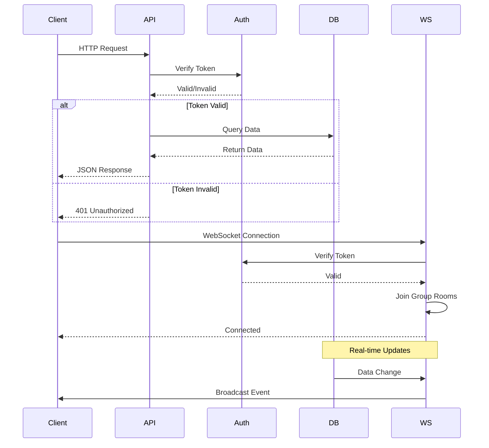
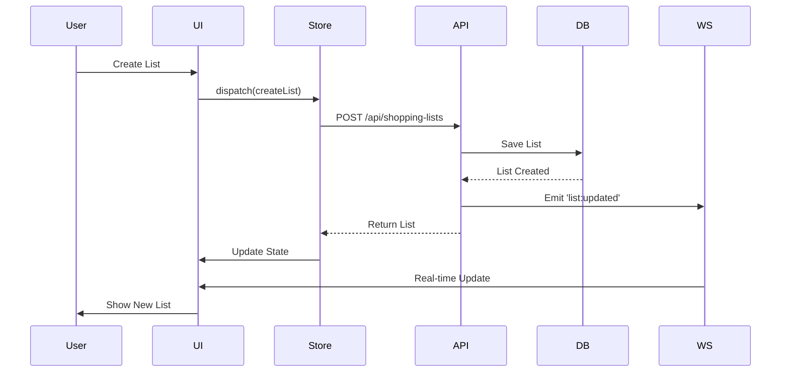
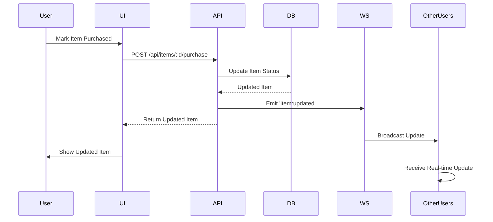
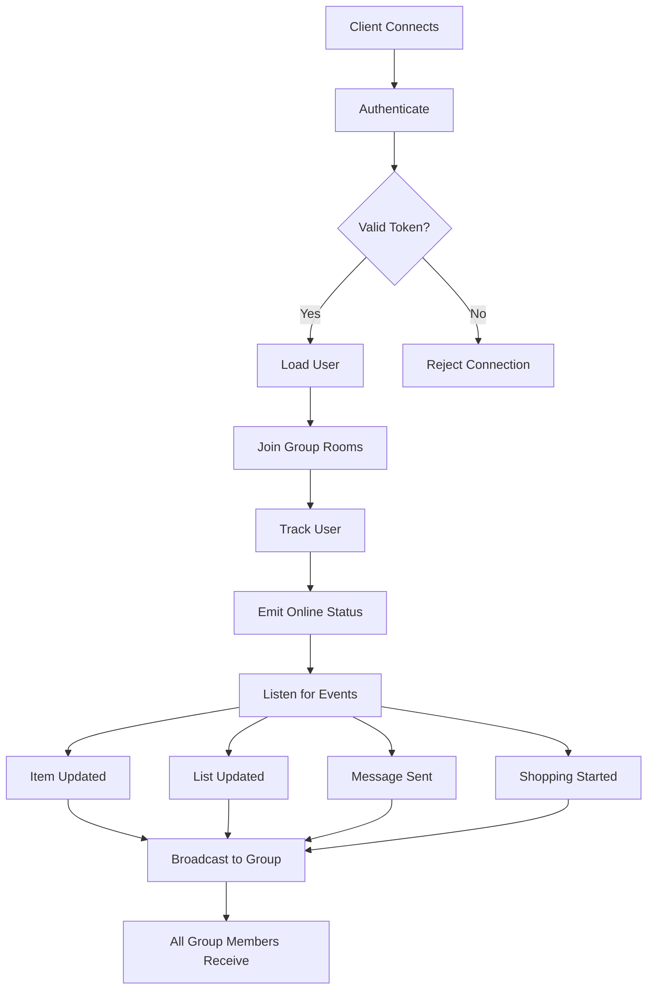
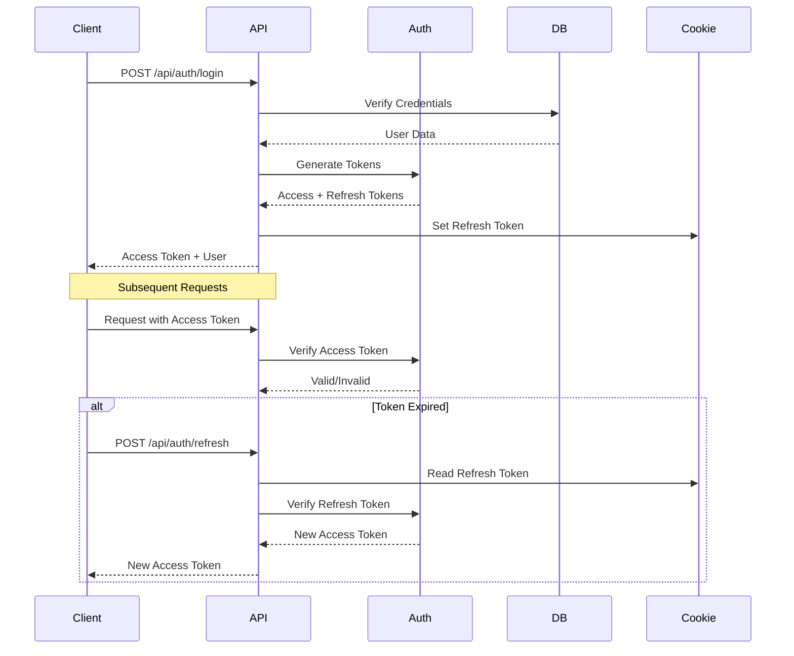
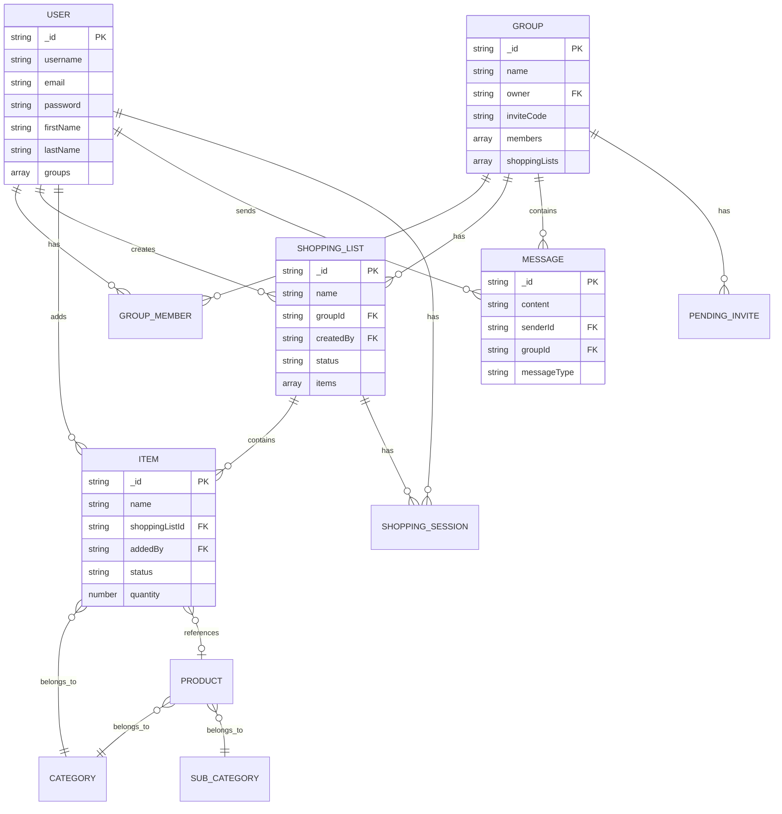

# ListaLi Architecture Documentation

<div dir="rtl">

# תיעוד ארכיטקטורה של ListaLi

תיעוד מפורט של הארכיטקטורה, המבנה והזרימה של מערכת ListaLi.

## 📋 תוכן עניינים

- [סקירה כללית](#סקירה-כללית)
- [ארכיטקטורה כללית](#ארכיטקטורה-כללית)
- [מבנה המערכת](#מבנה-המערכת)
- [זרימת נתונים](#זרימת-נתונים)
- [ארכיטקטורת WebSocket](#ארכיטקטורת-websocket)
- [ארכיטקטורת Authentication](#ארכיטקטורת-authentication)
- [מבנה Database](#מבנה-database)
- [Client Architecture](#client-architecture)
- [Server Architecture](#server-architecture)
- [תקשורת בין רכיבים](#תקשורת-בין-רכיבים)

## 🎯 סקירה כללית

ListaLi היא מערכת מבוססת Full-Stack לניהול רשימות קניות קבוצתיות עם תמיכה בזמן אמת.

### עקרונות עיצוב

- **Separation of Concerns**: הפרדה ברורה בין Frontend ו-Backend
- **Real-time Communication**: שימוש ב-WebSocket לעדכונים מיידיים
- **RESTful API**: API מובנה ומתועד
- **State Management**: ניהול state מרכזי ב-Client
- **Type Safety**: TypeScript בכל השכבות
- **Scalability**: תמיכה בפריסה אופקית

---

## 🏗️ ארכיטקטורה כללית

### דיאגרמת המערכת הכללית

```
┌─────────────────────────────────────────────────────────────┐
│                        CLIENT LAYER                          │
│  ┌──────────────────────────────────────────────────────┐  │
│  │              Next.js Frontend Application              │  │
│  │  ┌──────────┐  ┌──────────┐  ┌──────────┐           │  │
│  │  │   UI     │  │  State   │  │  WebSocket│           │  │
│  │  │Components│  │  Store   │  │  Client   │           │  │
│  │  └──────────┘  └──────────┘  └──────────┘           │  │
│  └──────────────────────────────────────────────────────┘  │
└─────────────────────────────────────────────────────────────┘
                            │
                            │ HTTPS/WSS
                            │ REST API
                            │ WebSocket
                            │
┌─────────────────────────────────────────────────────────────┐
│                        SERVER LAYER                          │
│  ┌──────────────────────────────────────────────────────┐  │
│  │            Express.js API Server                      │  │
│  │  ┌──────────┐  ┌──────────┐  ┌──────────┐          │  │
│  │  │ Routes   │  │Controllers│  │Middleware│          │  │
│  │  └──────────┘  └──────────┘  └──────────┘          │  │
│  │  ┌──────────────────────────────────────────────┐   │  │
│  │  │         Socket.IO Server                      │   │  │
│  │  │  ┌──────────┐  ┌──────────┐  ┌──────────┐  │   │  │
│  │  │  │  Auth    │  │  Events   │  │  Rooms   │  │   │  │
│  │  │  └──────────┘  └──────────┘  └──────────┘  │   │  │
│  │  └──────────────────────────────────────────────┘   │  │
│  └──────────────────────────────────────────────────────┘  │
└─────────────────────────────────────────────────────────────┘
                            │
                            │ Mongoose ODM
                            │
┌─────────────────────────────────────────────────────────────┐
│                      DATABASE LAYER                          │
│  ┌──────────────────────────────────────────────────────┐  │
│  │              MongoDB Database                          │  │
│  │  ┌──────────┐  ┌──────────┐  ┌──────────┐          │  │
│  │  │  Users   │  │  Groups  │  │  Lists    │          │  │
│  │  └──────────┘  └──────────┘  └──────────┘          │  │
│  │  ┌──────────┐  ┌──────────┐  ┌──────────┐          │  │
│  │  │  Items   │  │ Messages │  │ Products │          │  │
│  │  └──────────┘  └──────────┘  └──────────┘          │  │
│  └──────────────────────────────────────────────────────┘  │
└─────────────────────────────────────────────────────────────┘
```

### דיאגרמת זרימת הבקשות



---

## 📦 מבנה המערכת

### Client Architecture

```
client/
├── src/
│   ├── app/                    # Next.js App Router
│   │   ├── [locale]/           # Internationalized routes
│   │   │   ├── groups/         # Group pages
│   │   │   ├── lists/          # Shopping list pages
│   │   │   └── settings/       # Settings pages
│   │   └── layout.tsx          # Root layout
│   │
│   ├── components/             # React Components
│   │   ├── auth/              # Authentication components
│   │   ├── groups/             # Group management
│   │   ├── shoppingList/      # Shopping list UI
│   │   ├── chat/              # Chat components
│   │   └── common/            # Shared components
│   │
│   ├── hooks/                  # Custom React Hooks
│   │   ├── useAuth.ts         # Authentication logic
│   │   ├── useGroups.ts       # Group operations
│   │   ├── useItems.ts        # Item operations
│   │   └── useChat.ts         # Chat operations
│   │
│   ├── store/                  # Zustand State Stores
│   │   ├── authStore.ts       # Auth state
│   │   ├── groupStore.ts      # Group state
│   │   └── themeStore.ts      # Theme state
│   │
│   ├── lib/                    # Utilities & API
│   │   ├── api.ts             # API client
│   │   ├── utils.ts           # Helper functions
│   │   └── queries.ts         # React Query config
│   │
│   ├── services/               # External Services
│   │   └── websocket.ts       # WebSocket client
│   │
│   └── types/                  # TypeScript Types
│       └── index.ts            # Shared types
```

### Server Architecture

```
server/
├── src/
│   ├── app.ts                  # Express app setup
│   ├── server.ts               # Server entry point
│   │
│   ├── routes/                  # API Routes
│   │   ├── auth.ts            # Authentication routes
│   │   ├── group.ts           # Group routes
│   │   ├── shoppingList.ts    # Shopping list routes
│   │   ├── item.ts            # Item routes
│   │   └── message.ts         # Message routes
│   │
│   ├── controllers/            # Business Logic
│   │   ├── auth.ts            # Auth controller
│   │   ├── group.ts           # Group controller
│   │   ├── shoppingList.ts    # List controller
│   │   └── item.ts            # Item controller
│   │
│   ├── models/                  # Mongoose Models
│   │   ├── user.ts            # User model
│   │   ├── group.ts           # Group model
│   │   ├── shoppingList.ts    # List model
│   │   └── item.ts            # Item model
│   │
│   ├── middleware/              # Express Middleware
│   │   ├── auth.ts            # Authentication
│   │   ├── validation.ts      # Input validation
│   │   └── handlers.ts        # Error handlers
│   │
│   ├── socket/                  # Socket.IO Handlers
│   │   └── socketHandler.ts   # Socket logic
│   │
│   ├── config/                 # Configuration
│   │   └── database.ts        # DB connection
│   │
│   └── utils/                  # Utilities
│       ├── tokens.ts          # JWT utilities
│       └── email.ts            # Email service
```

---

## 🔄 זרימת נתונים

### זרימת יצירת רשימת קניות



### זרימת רכישת פריט



---

## 🔌 ארכיטקטורת WebSocket

### מבנה WebSocket

```
┌─────────────────────────────────────────────────────────┐
│                    Socket.IO Server                      │
│  ┌───────────────────────────────────────────────────┐  │
│  │              Authentication Middleware             │  │
│  │  - Verify JWT Token                               │  │
│  │  - Load User Data                                 │  │
│  │  - Validate User                                  │  │
│  └───────────────────────────────────────────────────┘  │
│  ┌───────────────────────────────────────────────────┐  │
│  │              Connection Handler                    │  │
│  │  - Track Connected Users                          │  │
│  │  - Join Group Rooms                               │  │
│  │  - Emit Online Status                             │  │
│  └───────────────────────────────────────────────────┘  │
│  ┌───────────────────────────────────────────────────┐  │
│  │              Event Handlers                        │  │
│  │  - list:updated                                   │  │
│  │  - item:updated                                  │  │
│  │  - shopping:started                              │  │
│  │  - chat:message                                  │  │
│  └───────────────────────────────────────────────────┘  │
└─────────────────────────────────────────────────────────┘
```

### Room Structure

```
Socket.IO Rooms:
├── group:{groupId}          # Group-specific room
│   ├── User A (socket.id)
│   ├── User B (socket.id)
│   └── User C (socket.id)
│
└── Global Events
    ├── user:status_changed
    ├── notification
    └── online_users
```

### WebSocket Event Flow



---

## 🔐 ארכיטקטורת Authentication

### Authentication Flow



### Token Structure

```
JWT Access Token:
├── Header
│   ├── alg: HS256
│   └── typ: JWT
├── Payload
│   ├── sub: userId
│   ├── email: user@example.com
│   └── exp: expiration
└── Signature

Refresh Token:
├── Stored in HTTP-only Cookie
├── Hashed in Database
└── Session-based Management
```

---

## 🗄️ מבנה Database

### Entity Relationship Diagram



### Database Collections

```
MongoDB Collections:
├── users
│   ├── _id
│   ├── username (unique)
│   ├── email (unique)
│   ├── password (hashed)
│   ├── groups[]
│   └── refreshSessions[]
│
├── groups
│   ├── _id
│   ├── name
│   ├── owner
│   ├── members[]
│   ├── shoppingLists[]
│   └── inviteCode
│
├── shoppinglists
│   ├── _id
│   ├── name
│   ├── group
│   ├── createdBy
│   ├── items[]
│   ├── status
│   └── metadata
│
├── items
│   ├── _id
│   ├── name
│   ├── shoppingList
│   ├── addedBy
│   ├── purchasedBy
│   ├── status
│   └── quantity
│
├── messages
│   ├── _id
│   ├── content
│   ├── sender
│   ├── group
│   ├── messageType
│   └── readBy[]
│
└── products
    ├── _id
    ├── name
    ├── categoryId
    ├── barcode
    └── image
```

---

## 💻 Client Architecture

### State Management Flow

```
┌─────────────────────────────────────────┐
│         React Components                 │
│  ┌─────────────────────────────────────┐ │
│  │      UI Layer (Next.js)             │ │
│  └─────────────────────────────────────┘ │
└─────────────────────────────────────────┘
              │
              │ Uses
              ▼
┌─────────────────────────────────────────┐
│      Custom Hooks (Business Logic)      │
│  ┌─────────────────────────────────────┐ │
│  │  - useAuth()                        │ │
│  │  - useGroups()                      │ │
│  │  - useItems()                       │ │
│  │  - useChat()                        │ │
│  └─────────────────────────────────────┘ │
└─────────────────────────────────────────┘
              │
              │ Uses
              ▼
┌─────────────────────────────────────────┐
│    Zustand Stores (Global State)        │
│  ┌─────────────────────────────────────┐ │
│  │  - authStore                        │ │
│  │  - groupStore                       │ │
│  │  - themeStore                       │ │
│  └─────────────────────────────────────┘ │
└─────────────────────────────────────────┘
              │
              │ Uses
              ▼
┌─────────────────────────────────────────┐
│   React Query (Server State Cache)     │
│  ┌─────────────────────────────────────┐ │
│  │  - API Calls                        │ │
│  │  - Caching                          │ │
│  │  - Refetching                      │ │
│  └─────────────────────────────────────┘ │
└─────────────────────────────────────────┘
              │
              │ Uses
              ▼
┌─────────────────────────────────────────┐
│      API Client (HTTP Requests)         │
│  ┌─────────────────────────────────────┐ │
│  │  - axios                            │ │
│  │  - Request Interceptors             │ │
│  │  - Response Interceptors            │ │
│  └─────────────────────────────────────┘ │
└─────────────────────────────────────────┘
```

### Component Hierarchy

```
App Layout
├── AuthProvider
│   └── AuthInitializer
├── ThemeProvider
├── QueryClientProvider
│   └── Routes
│       ├── /groups
│       │   └── GroupsPage
│       │       └── GroupList
│       ├── /groups/:id
│       │   └── GroupDetailPage
│       │       ├── ShoppingLists
│       │       └── ChatComponent
│       └── /lists/:id
│           └── ShoppingListPage
│               └── ItemList
```

---

## 🖥️ Server Architecture

### Request Processing Flow

```
HTTP Request
    │
    ▼
┌──────────────────┐
│  Express App     │
│  - CORS          │
│  - Helmet        │
│  - Rate Limit    │
└──────────────────┘
    │
    ▼
┌──────────────────┐
│  Route Handler   │
│  - Path Matching │
│  - Method Check  │
└──────────────────┘
    │
    ▼
┌──────────────────┐
│  Middleware      │
│  - Auth          │
│  - Validation    │
└──────────────────┘
    │
    ▼
┌──────────────────┐
│  Controller      │
│  - Business Logic│
│  - Data Transform│
└──────────────────┘
    │
    ▼
┌──────────────────┐
│  Model           │
│  - Mongoose ODM  │
│  - Validation    │
└──────────────────┘
    │
    ▼
┌──────────────────┐
│  MongoDB         │
│  - Query         │
│  - Update       │
└──────────────────┘
    │
    ▼
┌──────────────────┐
│  Socket.IO       │
│  - Emit Events   │
│  - Broadcast     │
└──────────────────┘
    │
    ▼
Response to Client
```

### Middleware Stack

```
Request
  │
  ├─► CORS Middleware
  │     └─► Check Origin
  │
  ├─► Helmet Middleware
  │     └─► Security Headers
  │
  ├─► Rate Limiter
  │     └─► Limit Requests
  │
  ├─► Body Parser
  │     └─► Parse JSON
  │
  ├─► Cookie Parser
  │     └─► Parse Cookies
  │
  ├─► Authentication (if protected)
  │     └─► Verify JWT
  │
  ├─► Validation (if needed)
  │     └─► Validate Input
  │
  └─► Route Handler
        └─► Controller
```

---

## 🔗 תקשורת בין רכיבים

### API Communication Pattern

```
Client Request Pattern:
┌─────────────┐
│   Component │
└──────┬──────┘
       │
       ▼
┌─────────────┐
│    Hook     │
└──────┬──────┘
       │
       ▼
┌─────────────┐
│  API Client │
└──────┬──────┘
       │
       ▼
┌─────────────┐
│   Server    │
└─────────────┘

Response Pattern:
┌─────────────┐
│   Server    │
└──────┬──────┘
       │
       ▼
┌─────────────┐
│  API Client │
└──────┬──────┘
       │
       ▼
┌─────────────┐
│ React Query │
└──────┬──────┘
       │
       ▼
┌─────────────┐
│   Store     │
└──────┬──────┘
       │
       ▼
┌─────────────┐
│  Component  │
└─────────────┘
```

### WebSocket Communication Pattern

```
Real-time Update Flow:
┌─────────────┐
│   Database  │
│   Change    │
└──────┬──────┘
       │
       ▼
┌─────────────┐
│ Controller  │
│ Emits Event │
└──────┬──────┘
       │
       ▼
┌─────────────┐
│ Socket.IO   │
│ Server      │
└──────┬──────┘
       │
       ├──────────────┐
       │              │
       ▼              ▼
┌─────────────┐  ┌─────────────┐
│   Client A  │  │   Client B  │
│  Receives   │  │  Receives   │
└─────────────┘  └─────────────┘
```

---

## 📊 Data Flow Diagrams

### Creating a Shopping List

```
User Action: Create List
    │
    ▼
┌─────────────────────┐
│  UI Component       │
│  - Form Input       │
│  - Validation       │
└──────────┬──────────┘
           │
           ▼
┌─────────────────────┐
│  useShoppingLists() │
│  Hook               │
└──────────┬──────────┘
           │
           ▼
┌─────────────────────┐
│  API Client         │
│  POST /shopping-lists│
└──────────┬──────────┘
           │
           ▼
┌─────────────────────┐
│  Server Controller  │
│  - Validate         │
│  - Create List      │
└──────────┬──────────┘
           │
           ▼
┌─────────────────────┐
│  MongoDB            │
│  Save Document      │
└──────────┬──────────┘
           │
           ├──────────────────┐
           │                  │
           ▼                  ▼
┌─────────────────────┐  ┌─────────────────────┐
│  HTTP Response      │  │  Socket.IO Emit      │
│  Return List        │  │  'list:updated'      │
└──────────┬──────────┘  └──────────┬───────────┘
           │                        │
           │                        │
           └──────────┬─────────────┘
                      │
                      ▼
           ┌─────────────────────┐
           │  All Group Members   │
           │  Receive Update      │
           └─────────────────────┘
```

---

## 🎨 Design Patterns

### Patterns בשימוש

1. **Repository Pattern**: Models משמשים כ-Repository
2. **Middleware Pattern**: Express middleware chain
3. **Observer Pattern**: WebSocket events
4. **Singleton Pattern**: WebSocket service
5. **Factory Pattern**: Model creation
6. **Strategy Pattern**: Authentication strategies

---

## 🔒 Security Architecture

### Security Layers

```
┌─────────────────────────────────┐
│  1. Network Layer               │
│     - HTTPS/WSS                 │
│     - Firewall                  │
└─────────────────────────────────┘
           │
           ▼
┌─────────────────────────────────┐
│  2. Application Layer           │
│     - CORS                      │
│     - Helmet                    │
│     - Rate Limiting             │
└─────────────────────────────────┘
           │
           ▼
┌─────────────────────────────────┐
│  3. Authentication Layer        │
│     - JWT Tokens                │
│     - Refresh Tokens            │
│     - Session Management       │
└─────────────────────────────────┘
           │
           ▼
┌─────────────────────────────────┐
│  4. Authorization Layer         │
│     - Role-based Access         │
│     - Permission Checks         │
└─────────────────────────────────┘
           │
           ▼
┌─────────────────────────────────┐
│  5. Data Layer                  │
│     - Input Validation          │
│     - SQL Injection Prevention │
│     - XSS Protection           │
└─────────────────────────────────┘
```

---

## 📈 Scalability Considerations

### Horizontal Scaling

```
Load Balancer
    │
    ├──────────┬──────────┐
    │          │          │
    ▼          ▼          ▼
┌────────┐ ┌────────┐ ┌────────┐
│Server 1│ │Server 2│ │Server 3│
└────┬───┘ └────┬───┘ └────┬───┘
     │          │          │
     └──────────┼──────────┘
                │
                ▼
         ┌──────────┐
         │ MongoDB  │
         │ Cluster │
         └──────────┘
```

### WebSocket Scaling

```
Redis Adapter
    │
    ├──────────┬──────────┐
    │          │          │
    ▼          ▼          ▼
┌────────┐ ┌────────┐ ┌────────┐
│Server 1│ │Server 2│ │Server 3│
└────────┘ └────────┘ └────────┘
```

---

**עודכן לאחרונה**: 2025

</div>

<div dir="ltr">

# ListaLi Architecture Documentation

Detailed documentation of the architecture, structure, and flow of the ListaLi system.

## 📋 Table of Contents

- [Overview](#overview)
- [General Architecture](#general-architecture)
- [System Structure](#system-structure)
- [Data Flow](#data-flow)
- [WebSocket Architecture](#websocket-architecture)
- [Authentication Architecture](#authentication-architecture)
- [Database Structure](#database-structure)
- [Client Architecture](#client-architecture)
- [Server Architecture](#server-architecture)
- [Component Communication](#component-communication)

## 🎯 Overview

ListaLi is a Full-Stack system for managing shared shopping lists with real-time support.

### Design Principles

- **Separation of Concerns**: Clear separation between Frontend and Backend
- **Real-time Communication**: WebSocket for instant updates
- **RESTful API**: Structured and documented API
- **State Management**: Centralized state management in Client
- **Type Safety**: TypeScript across all layers
- **Scalability**: Support for horizontal scaling

---

## 🏗️ General Architecture

### System Overview Diagram

```
┌─────────────────────────────────────────────────────────────┐
│                        CLIENT LAYER                          │
│  ┌──────────────────────────────────────────────────────┐  │
│  │              Next.js Frontend Application              │  │
│  │  ┌──────────┐  ┌──────────┐  ┌──────────┐           │  │
│  │  │   UI     │  │  State   │  │  WebSocket│           │  │
│  │  │Components│  │  Store   │  │  Client   │           │  │
│  │  └──────────┘  └──────────┘  └──────────┘           │  │
│  └──────────────────────────────────────────────────────┘  │
└─────────────────────────────────────────────────────────────┘
                            │
                            │ HTTPS/WSS
                            │ REST API
                            │ WebSocket
                            │
┌─────────────────────────────────────────────────────────────┐
│                        SERVER LAYER                          │
│  ┌──────────────────────────────────────────────────────┐  │
│  │            Express.js API Server                      │  │
│  │  ┌──────────┐  ┌──────────┐  ┌──────────┐          │  │
│  │  │ Routes   │  │Controllers│  │Middleware│          │  │
│  │  └──────────┘  └──────────┘  └──────────┘          │  │
│  │  ┌──────────────────────────────────────────────┐   │  │
│  │  │         Socket.IO Server                      │   │  │
│  │  │  ┌──────────┐  ┌──────────┐  ┌──────────┐  │   │  │
│  │  │  │  Auth    │  │  Events   │  │  Rooms   │  │   │  │
│  │  │  └──────────┘  └──────────┘  └──────────┘  │   │  │
│  │  └──────────────────────────────────────────────┘   │  │
│  └──────────────────────────────────────────────────────┘  │
└─────────────────────────────────────────────────────────────┘
                            │
                            │ Mongoose ODM
                            │
┌─────────────────────────────────────────────────────────────┐
│                      DATABASE LAYER                          │
│  ┌──────────────────────────────────────────────────────┐  │
│  │              MongoDB Database                          │  │
│  │  ┌──────────┐  ┌──────────┐  ┌──────────┐          │  │
│  │  │  Users   │  │  Groups  │  │  Lists    │          │  │
│  │  └──────────┘  └──────────┘  └──────────┘          │  │
│  │  ┌──────────┐  ┌──────────┐  ┌──────────┐          │  │
│  │  │  Items   │  │ Messages │  │ Products │          │  │
│  │  └──────────┘  └──────────┘  └──────────┘          │  │
│  └──────────────────────────────────────────────────────┘  │
└─────────────────────────────────────────────────────────────┘
```

### Request Flow Diagram


---

## 📦 System Structure

### Client Architecture

```
client/
├── src/
│   ├── app/                    # Next.js App Router
│   │   ├── [locale]/           # Internationalized routes
│   │   │   ├── groups/         # Group pages
│   │   │   ├── lists/          # Shopping list pages
│   │   │   └── settings/       # Settings pages
│   │   └── layout.tsx          # Root layout
│   │
│   ├── components/             # React Components
│   │   ├── auth/              # Authentication components
│   │   ├── groups/             # Group management
│   │   ├── shoppingList/        # Shopping list UI
│   │   ├── chat/              # Chat components
│   │   └── common/            # Shared components
│   │
│   ├── hooks/                  # Custom React Hooks
│   │   ├── useAuth.ts         # Authentication logic
│   │   ├── useGroups.ts       # Group operations
│   │   ├── useItems.ts        # Item operations
│   │   └── useChat.ts         # Chat operations
│   │
│   ├── store/                  # Zustand State Stores
│   │   ├── authStore.ts       # Auth state
│   │   ├── groupStore.ts      # Group state
│   │   └── themeStore.ts      # Theme state
│   │
│   ├── lib/                    # Utilities & API
│   │   ├── api.ts             # API client
│   │   ├── utils.ts           # Helper functions
│   │   └── queries.ts         # React Query config
│   │
│   ├── services/               # External Services
│   │   └── websocket.ts       # WebSocket client
│   │
│   └── types/                  # TypeScript Types
│       └── index.ts            # Shared types
```

### Server Architecture

```
server/
├── src/
│   ├── app.ts                  # Express app setup
│   ├── server.ts               # Server entry point
│   │
│   ├── routes/                  # API Routes
│   │   ├── auth.ts            # Authentication routes
│   │   ├── group.ts           # Group routes
│   │   ├── shoppingList.ts    # Shopping list routes
│   │   ├── item.ts            # Item routes
│   │   └── message.ts         # Message routes
│   │
│   ├── controllers/            # Business Logic
│   │   ├── auth.ts            # Auth controller
│   │   ├── group.ts           # Group controller
│   │   ├── shoppingList.ts    # List controller
│   │   └── item.ts            # Item controller
│   │
│   ├── models/                  # Mongoose Models
│   │   ├── user.ts            # User model
│   │   ├── group.ts           # Group model
│   │   ├── shoppingList.ts    # List model
│   │   └── item.ts            # Item model
│   │
│   ├── middleware/              # Express Middleware
│   │   ├── auth.ts            # Authentication
│   │   ├── validation.ts      # Input validation
│   │   └── handlers.ts        # Error handlers
│   │
│   ├── socket/                  # Socket.IO Handlers
│   │   └── socketHandler.ts   # Socket logic
│   │
│   ├── config/                 # Configuration
│   │   └── database.ts        # DB connection
│   │
│   └── utils/                  # Utilities
│       ├── tokens.ts          # JWT utilities
│       └── email.ts           # Email service
```

---

## 🔄 Data Flow

### Shopping List Creation Flow


### Item Purchase Flow


---

## 🔌 WebSocket Architecture

### WebSocket Structure

```
┌─────────────────────────────────────────────────────────┐
│                    Socket.IO Server                      │
│  ┌───────────────────────────────────────────────────┐  │
│  │              Authentication Middleware             │  │
│  │  - Verify JWT Token                               │  │
│  │  - Load User Data                                 │  │
│  │  - Validate User                                  │  │
│  └───────────────────────────────────────────────────┘  │
│  ┌───────────────────────────────────────────────────┐  │
│  │              Connection Handler                    │  │
│  │  - Track Connected Users                          │  │
│  │  - Join Group Rooms                               │  │
│  │  - Emit Online Status                             │  │
│  └───────────────────────────────────────────────────┘  │
│  ┌───────────────────────────────────────────────────┐  │
│  │              Event Handlers                        │  │
│  │  - list:updated                                   │  │
│  │  - item:updated                                  │  │
│  │  - shopping:started                              │  │
│  │  - chat:message                                  │  │
│  └───────────────────────────────────────────────────┘  │
└─────────────────────────────────────────────────────────┘
```

### Room Structure

```
Socket.IO Rooms:
├── group:{groupId}          # Group-specific room
│   ├── User A (socket.id)
│   ├── User B (socket.id)
│   └── User C (socket.id)
│
└── Global Events
    ├── user:status_changed
    ├── notification
    └── online_users
```

### WebSocket Event Flow


---

## 🔐 Authentication Architecture

### Authentication Flow


### Token Structure

```
JWT Access Token:
├── Header
│   ├── alg: HS256
│   └── typ: JWT
├── Payload
│   ├── sub: userId
│   ├── email: user@example.com
│   └── exp: expiration
└── Signature

Refresh Token:
├── Stored in HTTP-only Cookie
├── Hashed in Database
└── Session-based Management
```

---

## 🗄️ Database Structure

### Entity Relationship Diagram


### Database Collections

```
MongoDB Collections:
├── users
│   ├── _id
│   ├── username (unique)
│   ├── email (unique)
│   ├── password (hashed)
│   ├── groups[]
│   └── refreshSessions[]
│
├── groups
│   ├── _id
│   ├── name
│   ├── owner
│   ├── members[]
│   ├── shoppingLists[]
│   └── inviteCode
│
├── shoppinglists
│   ├── _id
│   ├── name
│   ├── group
│   ├── createdBy
│   ├── items[]
│   ├── status
│   └── metadata
│
├── items
│   ├── _id
│   ├── name
│   ├── shoppingList
│   ├── addedBy
│   ├── purchasedBy
│   ├── status
│   └── quantity
│
├── messages
│   ├── _id
│   ├── content
│   ├── sender
│   ├── group
│   ├── messageType
│   └── readBy[]
│
└── products
    ├── _id
    ├── name
    ├── categoryId
    ├── barcode
    └── image
```

---

## 💻 Client Architecture

### State Management Flow

```
┌─────────────────────────────────────────┐
│         React Components                 │
│  ┌─────────────────────────────────────┐ │
│  │      UI Layer (Next.js)             │ │
│  └─────────────────────────────────────┘ │
└─────────────────────────────────────────┘
              │
              │ Uses
              ▼
┌─────────────────────────────────────────┐
│      Custom Hooks (Business Logic)      │
│  ┌─────────────────────────────────────┐ │
│  │  - useAuth()                        │ │
│  │  - useGroups()                      │ │
│  │  - useItems()                       │ │
│  │  - useChat()                        │ │
│  └─────────────────────────────────────┘ │
└─────────────────────────────────────────┘
              │
              │ Uses
              ▼
┌─────────────────────────────────────────┐
│    Zustand Stores (Global State)        │
│  ┌─────────────────────────────────────┐ │
│  │  - authStore                        │ │
│  │  - groupStore                       │ │
│  │  - themeStore                       │ │
│  └─────────────────────────────────────┘ │
└─────────────────────────────────────────┘
              │
              │ Uses
              ▼
┌─────────────────────────────────────────┐
│   React Query (Server State Cache)      │
│  ┌─────────────────────────────────────┐ │
│  │  - API Calls                        │ │
│  │  - Caching                          │ │
│  │  - Refetching                      │ │
│  └─────────────────────────────────────┘ │
└─────────────────────────────────────────┘
              │
              │ Uses
              ▼
┌─────────────────────────────────────────┐
│      API Client (HTTP Requests)         │
│  ┌─────────────────────────────────────┐ │
│  │  - axios                            │ │
│  │  - Request Interceptors             │ │
│  │  - Response Interceptors            │ │
│  └─────────────────────────────────────┘ │
└─────────────────────────────────────────┘
```

### Component Hierarchy

```
App Layout
├── AuthProvider
│   └── AuthInitializer
├── ThemeProvider
├── QueryClientProvider
│   └── Routes
│       ├── /groups
│       │   └── GroupsPage
│       │       └── GroupList
│       ├── /groups/:id
│       │   └── GroupDetailPage
│       │       ├── ShoppingLists
│       │       └── ChatComponent
│       └── /lists/:id
│           └── ShoppingListPage
│               └── ItemList
```

---

## 🖥️ Server Architecture

### Request Processing Flow

```
HTTP Request
    │
    ▼
┌──────────────────┐
│  Express App     │
│  - CORS          │
│  - Helmet        │
│  - Rate Limit    │
└──────────────────┘
    │
    ▼
┌──────────────────┐
│  Route Handler   │
│  - Path Matching │
│  - Method Check  │
└──────────────────┘
    │
    ▼
┌──────────────────┐
│  Middleware      │
│  - Auth          │
│  - Validation    │
└──────────────────┘
    │
    ▼
┌──────────────────┐
│  Controller      │
│  - Business Logic│
│  - Data Transform│
└──────────────────┘
    │
    ▼
┌──────────────────┐
│  Model           │
│  - Mongoose ODM  │
│  - Validation    │
└──────────────────┘
    │
    ▼
┌──────────────────┐
│  MongoDB         │
│  - Query         │
│  - Update       │
└──────────────────┘
    │
    ▼
┌──────────────────┐
│  Socket.IO       │
│  - Emit Events   │
│  - Broadcast     │
└──────────────────┘
    │
    ▼
Response to Client
```

### Middleware Stack

```
Request
  │
  ├─► CORS Middleware
  │     └─► Check Origin
  │
  ├─► Helmet Middleware
  │     └─► Security Headers
  │
  ├─► Rate Limiter
  │     └─► Limit Requests
  │
  ├─► Body Parser
  │     └─► Parse JSON
  │
  ├─► Cookie Parser
  │     └─► Parse Cookies
  │
  ├─► Authentication (if protected)
  │     └─► Verify JWT
  │
  ├─► Validation (if needed)
  │     └─► Validate Input
  │
  └─► Route Handler
        └─► Controller
```

---

## 🔗 Component Communication

### API Communication Pattern

```
Client Request Pattern:
┌─────────────┐
│   Component │
└──────┬──────┘
       │
       ▼
┌─────────────┐
│    Hook     │
└──────┬──────┘
       │
       ▼
┌─────────────┐
│  API Client │
└──────┬──────┘
       │
       ▼
┌─────────────┐
│   Server    │
└─────────────┘

Response Pattern:
┌─────────────┐
│   Server    │
└──────┬──────┘
       │
       ▼
┌─────────────┐
│  API Client │
└──────┬──────┘
       │
       ▼
┌─────────────┐
│ React Query │
└──────┬──────┘
       │
       ▼
┌─────────────┐
│   Store     │
└──────┬──────┘
       │
       ▼
┌─────────────┐
│  Component  │
└─────────────┘
```

### WebSocket Communication Pattern

```
Real-time Update Flow:
┌─────────────┐
│   Database  │
│   Change    │
└──────┬──────┘
       │
       ▼
┌─────────────┐
│ Controller  │
│ Emits Event │
└──────┬──────┘
       │
       ▼
┌─────────────┐
│ Socket.IO   │
│ Server      │
└──────┬──────┘
       │
       ├──────────────┐
       │              │
       ▼              ▼
┌─────────────┐  ┌─────────────┐
│   Client A  │  │   Client B  │
│  Receives   │  │  Receives   │
└─────────────┘  └─────────────┘
```

---

## 📊 Data Flow Diagrams

### Creating a Shopping List

```
User Action: Create List
    │
    ▼
┌─────────────────────┐
│  UI Component       │
│  - Form Input       │
│  - Validation       │
└──────────┬──────────┘
           │
           ▼
┌─────────────────────┐
│  useShoppingLists() │
│  Hook               │
└──────────┬──────────┘
           │
           ▼
┌─────────────────────┐
│  API Client         │
│  POST /shopping-lists│
└──────────┬──────────┘
           │
           ▼
┌─────────────────────┐
│  Server Controller  │
│  - Validate         │
│  - Create List      │
└──────────┬──────────┘
           │
           ▼
┌─────────────────────┐
│  MongoDB            │
│  Save Document      │
└──────────┬──────────┘
           │
           ├──────────────────┐
           │                  │
           ▼                  ▼
┌─────────────────────┐  ┌─────────────────────┐
│  HTTP Response      │  │  Socket.IO Emit      │
│  Return List        │  │  'list:updated'      │
└──────────┬──────────┘  └──────────┬───────────┘
           │                        │
           │                        │
           └──────────┬─────────────┘
                      │
                      ▼
           ┌─────────────────────┐
           │  All Group Members   │
           │  Receive Update      │
           └─────────────────────┘
```

---

## 🎨 Design Patterns

### Patterns Used

1. **Repository Pattern**: Models act as Repository
2. **Middleware Pattern**: Express middleware chain
3. **Observer Pattern**: WebSocket events
4. **Singleton Pattern**: WebSocket service
5. **Factory Pattern**: Model creation
6. **Strategy Pattern**: Authentication strategies

---

## 🔒 Security Architecture

### Security Layers

```
┌─────────────────────────────────┐
│  1. Network Layer               │
│     - HTTPS/WSS                 │
│     - Firewall                  │
└─────────────────────────────────┘
           │
           ▼
┌─────────────────────────────────┐
│  2. Application Layer           │
│     - CORS                      │
│     - Helmet                    │
│     - Rate Limiting             │
└─────────────────────────────────┘
           │
           ▼
┌─────────────────────────────────┐
│  3. Authentication Layer        │
│     - JWT Tokens                │
│     - Refresh Tokens            │
│     - Session Management       │
└─────────────────────────────────┘
           │
           ▼
┌─────────────────────────────────┐
│  4. Authorization Layer         │
│     - Role-based Access         │
│     - Permission Checks         │
└─────────────────────────────────┘
           │
           ▼
┌─────────────────────────────────┐
│  5. Data Layer                  │
│     - Input Validation          │
│     - SQL Injection Prevention │
│     - XSS Protection           │
└─────────────────────────────────┘
```

---

## 📈 Scalability Considerations

### Horizontal Scaling

```
Load Balancer
    │
    ├──────────┬──────────┐
    │          │          │
    ▼          ▼          ▼
┌────────┐ ┌────────┐ ┌────────┐
│Server 1│ │Server 2│ │Server 3│
└────┬───┘ └────┬───┘ └────┬───┘
     │          │          │
     └──────────┼──────────┘
                │
                ▼
         ┌──────────┐
         │ MongoDB  │
         │ Cluster  │
         └──────────┘
```

### WebSocket Scaling

```
Redis Adapter
    │
    ├──────────┬──────────┐
    │          │          │
    ▼          ▼          ▼
┌────────┐ ┌────────┐ ┌────────┐
│Server 1│ │Server 2│ │Server 3│
└────────┘ └────────┘ └────────┘
```

---

**Last Updated**: 2025

</div>
